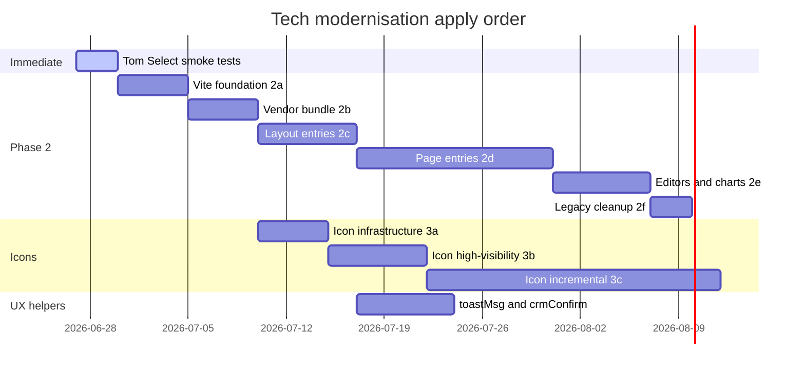

# Tech Update — Modernisation Status & Plan

**Created:** 2026-06-27  
**Branch audited:** `master` (synced with `origin/master`)  
**Purpose:** Record current frontend/asset modernisation state, reconcile with recent work summaries, and define a phased plan to apply remaining changes.

---

## Executive summary

A summary of **26–27 Jun 2026** modernisation work (Phase 2 Vite, Lucide/IconHelper, FA 6, `vendor-libs.js`, etc.) does **not** match what is on `master` in this workspace. There are **no commits** on 26–27 Jun for that work, and the expected artifacts are absent.

What **is** live today:

| Area | Status |
|------|--------|
| Select2 → Tom Select | **Largely complete** (core migration ~18 May 2026) |
| Vite | **Minimal** — 3 entries only (`app.css`, `fullcalendar-v6.css`, `app.js`) |
| Font Awesome | **FA 5.11.2** — local copy, heavy use across templates |
| Lucide / IconHelper | **Not started** |
| Phase 2 asset bundling | **Not started** |
| Central toast/confirm helpers | **Not started** |

This document is the source of truth for what remains and how to apply it.

---

## Current stack (as of audit)

| Tool | Version / location |
|------|-------------------|
| Node | ≥22 (per project convention) |
| Vite | 8.x (`vite.config.js`) |
| Laravel Vite plugin | 3.1.x |
| Tom Select | 2.6.x — copied to `public/js/` via `npm run copy:tom-select` |
| DataTables | npm — copied via `npm run copy:datatables` |
| flatpickr, inputmask | npm — copied to `public/` |
| jQuery | 3.7.1 CDN in layout `<head>` |
| TinyMCE | Self-hosted under `public/js/tinymce/` |
| Font Awesome | 5.11.2 in `public/icons/font-awesome/` |
| Bootstrap | `public/css/app.min.css` via `asset()` (not Vite) |

**Vite inputs today** (`vite.config.js`):

- `resources/css/app.css`
- `resources/css/fullcalendar-v6.css`
- `resources/js/app.js`

**CRM layouts** (`resources/views/layouts/crm_client_detail.blade.php`) still load many raw `<script src="{{ asset('js/...') }}">` tags plus vendor CSS/JS from `public/`.

---

## Reconciliation: summary vs repo

The following were described as done on 26–27 Jun but are **not present** on `master`:

| Claimed | In repo? |
|---------|----------|
| `docs/PUBLIC-JS-LEGACY.md` | No |
| `docs/SELECT2-TOMSELECT-MIGRATION.md` | No |
| `IconHelper`, `@icon` directive, `crmIcon()` | No |
| Lucide npm package + `lucide-init.js` | No |
| FA 6 upgrade + `sync-fontawesome` script | No |
| Bootstrap CSS via Vite in `<head>` | No |
| Phase 2a: jQuery in layout `<head>`, out of Vite | Partially — jQuery is CDN in head, but was never in Vite |
| Many Vite entry points (layout, page-specific) | No |
| `vendor-libs.js` bundle | No |
| TinyMCE / ApexCharts / signature_pad via npm + Vite init | No |
| `npm run audit:legacy-js` | No |
| Removed `public/js/tinymce/` legacy tree | No — still present |
| Select2 removed 27 Jun | Select2 already gone since ~18 May |

**Action:** Treat the 26–27 Jun summary as a **target architecture**, not completed work. Apply in phases below.

---

## Track 1: Vite & asset pipeline (Phase 2)

**Status:** Not started  
**Priority:** High — unlocks bundling, FOUC fixes, and vendor consolidation

### Current pain points

- ~16+ raw script tags on client detail layout alone
- Vendor libs copied to `public/` instead of bundled
- Bootstrap loaded as pre-built `app.min.css` — header FOUC risk
- TinyMCE, DataTables, iziToast, Tom Select each loaded separately
- No tooling to find orphan/unused `public/js` files

### Plan to apply

#### Phase 2a — Foundation

- [ ] Add `docs/PUBLIC-JS-LEGACY.md` documenting `@legacy` alias and bundling rules
- [ ] Extend `vite.config.js` with `@legacy` → `public/js` alias
- [ ] Keep jQuery synchronous in layout `<head>` (CDN or local — do not bundle)
- [ ] Load Bootstrap CSS via Vite in `<head>` to fix header FOUC
- [ ] Add `npm run audit:legacy-js` script to list unreferenced `public/js` files

#### Phase 2b — Vendor bundle

- [ ] Create `resources/js/vendor-libs.js` entry importing:
  - flatpickr, iziToast, Tom Select, DataTables (+ buttons extension)
- [ ] Replace individual `<script>` / `<link>` tags in layouts with single `@vite` vendor entry
- [ ] Remove redundant copy-to-public steps where Vite handles the asset (keep copy scripts only during transition if needed)

#### Phase 2c — Layout entries

- [ ] Add Vite entries per layout:
  - `resources/js/layouts/admin.js`
  - `resources/js/layouts/agent.js`
  - `resources/js/layouts/adminconsole.js`
  - `resources/js/layouts/crm-client-detail.js`
- [ ] Migrate layout inline/boot scripts into these entries incrementally

#### Phase 2d — Page-specific entries

- [ ] High-traffic pages first:
  - Client detail (`detail-main.js` + modules)
  - Partner/company detail
  - Emails v2 / compose
  - Invoice / receipts
  - Popover / assign staff
- [ ] Each page: one Vite entry, remove corresponding raw `<script>` tags from Blade

#### Phase 2e — Heavy editors & charts

- [ ] TinyMCE 7.x via npm + dedicated init script (remove `public/js/tinymce/` tree)
- [ ] ApexCharts via npm + init where used
- [ ] signature_pad via npm (already in `package.json`) + init where used
- [ ] FullCalendar — extend existing v6 Vite entry pattern to any remaining calendar usages

#### Phase 2f — Cleanup

- [ ] Run `audit:legacy-js`; delete or bundle confirmed orphans
- [ ] Remove obsolete debug scripts if any remain
- [ ] Document final entry-point → screen mapping in `PUBLIC-JS-LEGACY.md`

---

## Track 2: Select2 → Tom Select

**Status:** Functionally complete; consolidation & QA pending  
**Priority:** Medium (verify before Phase 2 bundling)

### Done

- Select2 removed from runtime (no `.select2()` calls; only comments in `mm-tomselect-jquery.js`)
- `tom-select` npm package + `mm-tomselect-jquery.js` jQuery bridge (`.mmSelect()`)
- Tom Select CSS in layouts; fixes through Jun 2026 for compose email, assignee modals, client portal checklists

### Plan to apply

#### QA / smoke tests

- [ ] Create `docs/SELECT2-TOMSELECT-MIGRATION.md` with Phase 0 checklist
- [ ] Manual smoke test matrix:

| Screen / feature | Verify |
|------------------|--------|
| Global search | AJAX select, keyboard nav |
| Compose email (To/CC) | Recipient search, pre-fill on reply/forward |
| Change Matter Assignee modal | Dropdown positioning (`dropdownParent: 'body'`) |
| Add Application / Create In Person Client modals | All select fields init after modal open |
| Client portal — Add Checklist | Dropdown visible inside modal |
| Leads list filters | AJAX matter/client selects |
| Assign Staff popover | Staff multi-select |
| Partner/product forms | Dependent selects |
| Audit log filters | Date + staff selects |
| DOB search | Date/select behaviour |

#### Consolidation (after Phase 2b)

- [ ] Move Tom Select from copied `public/js/tom-select.complete.min.js` into `vendor-libs.js`
- [ ] Retire `scripts/copy-tom-select.cjs` once Vite bundle is stable

---

## Track 3: Icon system modernisation

**Status:** Not started  
**Priority:** Medium — large surface area; do incrementally

### Current state

- Font Awesome **5.11.2** in `public/icons/font-awesome/`
- 100+ Blade files use `fa` / `fas` / `fa fa-*` class strings
- Some pages still use FA 5 CDN (e.g. EOI confirmation sheets)
- No central icon abstraction

### Target architecture

- **Lucide** for new/key UI (sidebar, navbar, emails, sortable columns, attachments)
- **Font Awesome 6** with v4 shims for legacy references during transition
- **`IconHelper`** PHP class + **`@icon`** Blade directive
- **`crmIcon()`** JS helper for dynamically rendered icons

### Plan to apply

#### Phase 3a — Infrastructure

- [ ] Add `lucide` npm package
- [ ] Create `app/Helpers/IconHelper.php` (or `app/Support/IconHelper.php`)
- [ ] Register `@icon('name')` Blade directive
- [ ] Add `resources/js/lucide-init.js` Vite entry + `crmIcon(name, options)` in shared JS
- [ ] Add `npm run sync-fontawesome` (or equivalent) for FA 6 deploy
- [ ] Upgrade local FA 5 → FA 6.7.x with v4 shims
- [ ] CSS updates for SVG icon sizing/alignment in nav, buttons, tables

#### Phase 3b — High-visibility migration

- [ ] Sidebar + navbar (`Elements/CRM/header_client_detail.blade.php`, layouts)
- [ ] Dashboard KPI cards and task panels
- [ ] Email list labels and engagement icons
- [ ] Sortable column headers
- [ ] Attachment/file type icons

#### Phase 3c — Incremental rollout

- [ ] AdminConsole screens
- [ ] Client edit form field actions (trash, add row)
- [ ] Modals and popovers
- [ ] PHP-generated HTML (controllers returning icon markup — e.g. `ClientNotesController`)
- [ ] JS templates building HTML strings (`dashboard-optimized.js`, etc.)

#### Phase 3d — Cleanup

- [ ] Remove FA 5 CDN links from standalone pages
- [ ] Remove duplicate FA font trees under `public/fonts/` if consolidated
- [ ] Grep audit: zero raw `fa fa-` in migrated areas; document exceptions

---

## Track 4: UI patterns & Bootstrap 5 alignment

**Status:** Partially done (iziToast present; no central API)  
**Priority:** Medium — apply alongside Phase 2 layout entries

### Current state

- **iziToast** loaded globally; usage is ad hoc (`iziToast.show`, `.success`, `.error` scattered)
- **Native `confirm()`** still used in: `custom.js`, `emails.js`, `documents.js`, `eoi-roi.js`, `workflow-tab.js`, and others
- Bootstrap 5 in use; modal close buttons and patterns inconsistent

### Plan to apply

- [ ] Add `toastMsg(message, type)` / `showToast(options)` in shared layout JS (wrap iziToast)
- [ ] Add `crmConfirm(message, options)` — promise-based, Bootstrap modal or iziToast confirm
- [ ] Migrate high-traffic confirm call sites first (delete email, delete document, workflow stage change)
- [ ] Standardise BS5 modal close button markup in shared partial
- [ ] Prefer named routes in Blade edit/back links (ongoing cleanup)

---

## Track 5: Vendor library consolidation

**Status:** Partial — npm packages exist, still copied to `public/`  
**Priority:** Fold into Track 1 Phase 2b–2e

| Library | Today | Target |
|---------|-------|--------|
| Tom Select | npm → copy → `public/js` | Vite `vendor-libs.js` |
| DataTables | npm → copy → `public/js` | Vite bundle |
| flatpickr | npm → copy → `public/js` | Vite bundle |
| inputmask | npm → copy → `public/js` | Vite bundle |
| iziToast | `public/js/iziToast.min.js` | Vite bundle |
| TinyMCE | `public/js/tinymce/` | npm TinyMCE 7 + Vite init |
| ApexCharts | legacy/copied if present | npm + Vite init |
| signature_pad | in `package.json` | Vite init per page |
| FullCalendar | Vite on calendar-v6 page only | Extend pattern |

---

## Related performance work (same period, separate track)

These support the modernised UI but are product/perf fixes, not asset pipeline:

| Item | Notes |
|------|-------|
| Partner detail lazy tab loading | Verify on `companies/detail` |
| Server-side DataTables on Partner Student tab | Verify implementation |
| Cached counts for large partners | Backend/query work |
| Assign Staff popover polish | Ongoing UX |
| Global search polish | Ongoing UX |

---

## Other CRM plans (not frontend modernisation)

These remain open in `docs/` and are independent of this tech update:

| Document | Status |
|----------|--------|
| `PLAN_DEDICATED_STAFF_TABLE.md` | Phases 1–2 done; 3–7 pending |
| `PLAN_USER_TO_CLIENT_STAFF_RENAME.md` | Phases 1–3 done; 4–6 planned (do not apply DB migrations without approval) |
| `APPLICATION_TO_MATTER_MIGRATION_PLAN.md` | DB/cache/route renames pending |
| `TR_SHEET_IMPLEMENTATION_PLAN.md` | Feature plan |

Coordinate major DB migrations with maintenance windows; do not mix with frontend deploys unless tested together.

---

## Recommended apply order

**Rationale:**

1. **Tom Select QA first** — cheap validation before bundling moves files.
2. **Phase 2 foundation + vendor bundle** — highest leverage; unblocks everything else.
3. **Icon infrastructure early** — can migrate UI in parallel with page entries.
4. **Page entries incrementally** — client detail first (largest script surface).
5. **toast/confirm** — add helpers when layout JS moves into Vite entries.

---

## Pre-deploy checklist (each phase)

- [ ] `npm run build` succeeds
- [ ] No new console errors on: client detail, leads list, compose email, dashboard
- [ ] Tom Select dropdowns visible in modals (`dropdownParent: 'body'` where needed)
- [ ] DataTables pages load and export buttons work
- [ ] Calendar page (FullCalendar v6) still initialises
- [ ] Document sign/create flows (TinyMCE) unaffected until Phase 2e
- [ ] Smoke test on staging with production-like asset build (`npm run build`, not `npm run dev`)

---

## Commit / doc hygiene

When applying each phase:

1. Update this file — mark checkboxes and add completion date.
2. Keep `PUBLIC-JS-LEGACY.md` entry map in sync with `vite.config.js`.
3. One logical phase per PR where possible (easier rollback).
4. Do not commit `.env` or secrets.

---

## Revision log

| Date | Change |
|------|--------|
| 2026-06-27 | Initial audit and plan created from workspace inspection vs modernisation summary |
